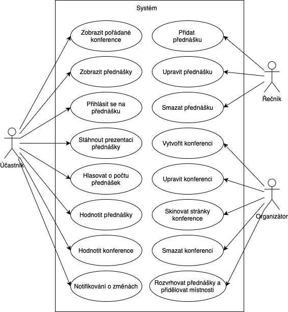

[Domů](/README.md) / [Dokumentace EDA](/Dokumentace/EDA/README.md) / [Architecture Background](/Dokumentace/EDA/pages/architecture-background.md)

# Architecture Background

## Problem Background

### System Overview
Organizátor se zabývá pořádáním konferencí, které probíhají po celé Evropě. Na konferencích vystupují řečníci se svými přednáškami. Konference jsou určené pro široký okruh účastníků. Organizátor potřebuje pro svoji činnost softwarový systém určený pro správu pořádaných konferencí, který bude využívat nejen on, ale i všichni řečníci a účastníci. Systém musí organizátorům umožňovat plánování, rozvrhování a správu konferencí. Řečníci musí být schopni systém využívat pro správu svých přednášek. Uživateli systému budou i samotní účastníci konferencí. Těm bude díky systému umožňěno sledovat online aktuální informace o jednotlivých přednáškách, hlasovat o počtu přednášek a hodnotit přednášky různými cestami. Systém musí nabízet účastníkům možnost hodnocení prostřednictvím webové stránky, e-mailu, SMS nebo telefonu. 

Dokumentace popisuje návrh systému s využitím událostmi řízené architektury.

### Context and scope
Tato dokumentace se zaměřuje na návrh softwarové architektury systému pro správu konferencí. Na základě identifikovaných požadavků a omezení zásadních pro daný systém a popsaných použitých architektonických přístupů jsou vytvořeny modely pro tři nejdůležitější pohledy na navrženou softwarovou architekturu.

### Driving Requirements

#### Functional Requirements
*Rozvrhování přednášek*
- Systém by měl řečníkům umožnit zadávat, upravovat a měnit své přednášky. 
- Systém by měl obsahovat funkce pro automatické rozvrhování přednášek.
- Účastníci by měly díky systému mít online k dispozici aktuální rozvrh přednášek dané konference (včetně informací o přidělených místnostech, resp. sálech). 

*Archiv prezentací*
- Systém by měl účastníkům přednášky online zřístupňovat prezentace řečníků. 
- Archiv prezentací by měl být pro účastníky k dispozici i po skončení konference. 

*Autentizace a autorizace*
- Systém by měl umožňit registrace účastníků a řečníků. Součástí registrace by bylo vyplnění základních osobních údajů a typu uživatele.

*Přihlašování na přednášky*
- Systém by měl umožňit přihlašování na jednotlivé přednášky konferencí, resp. odhlášování účastníků z přednášek.
- Systém by měl uživateli přehledně zobrazovat všechny přednášky, na které je jako účastník přihlášen. 

*Vizuální editor*
- Systém by měl umožňovat vytvářet konference s originální vizuální identitou (brandem).
- Systém by měl organizátorovi umožňovat snadnou úpravu vzhledu stránek konferencí s využitím integrovaného grafického editoru. 

*Hodnocení a hlasování*
- Systém by měl umožňovat účastníkům hlasování o zvýšení a snížení počtu přednášek. 
- Systém by měl účastníkům umožnit odesílat hodnocení přednášek (resp. celých konferencí), kterých se zúčastnili. 
- Systém hodnocení bude umožněn nejen prostřednictvím webových stránek, ale i prostřednictvím emailu, SMS a telefonu. 

*Notifikace účastníků*
- Systém by měl umožňovat rychlé odesílání notifikací účastníkům o změnách v rozvrhu přednášek. 

#### Quality Assurance Requirements
- Systém by měl mít nízkou dobu odezvy, tak aby dokázal rychle reagovat na změny rozvrhování, hlasování atd.
- Systém by měl být dostatečně výkonný aby zvládl nárůst provozu v době konání konferencí.
- Systém by měl zajistit bezpečné uchování uživatelských dat. 

## Solution Background

### Architectural Approaches
Pro návrh systému pro správu konferencí byla zvolena událostmi řízená architektura s topologií Meidátor. 

Hlavním producentem událostí budou klientské aplikace (tj. uživatelské rozhraní) v podobě webové a mobilní aplikace. 

Jako konzumenti událostí budou vystupovat následující komponenty:
- Conference Manager: vytváření, úprava a správa konferencí, customizace vizuální identity konference.
- Presentation Manager: zadávání, úprava a správa přednášek a prezentací řečníků.
- Scheduler: rozvrhování přednášek a přiřazování volných místnost,
- Reviewer: hodnocení přednášek a konferencí, komunikuje s telefonní a SMS bránou (Twilio CPaaS),
- Notificator: odesílání notifikací účastníkům.

Centrálním prvkem zajišťující distribuci událostí bude komponenta mediátoru. Meidátor bude plnit úlohu prostředníka mezi klientskými aplikacemi a komponentami zajišťující jednotlivé funkčnosti systému. Z klientských aplikací budou událost předávány do fronty zpráv, ze které bude mediátor zprávy synchronním způsobem vybírat a distribuovat do kanálů zpráv jednotlivých komponent zodpovědných za požadovanou funkčnost. 

Události budou mít podobu zpráv ve formátu JSON. Zasílané zprávy tak budou odlehčené a jednoduché. 

### Analysis Results
N/A

### Mapping Requirements to Architecture
Následující use case diagram znázorňuje hlavní uživatelské požadavky systému pro správu konferencí:

**Conference Manager**
- Zobrazit pořádané konference
- Vytvořit konferenci
- Upravit konferenci
- Smazat konferenci

**Presentation Manager**
- Zobrazit přednášky
- Přihlásit se na přednášku
- Stáhnout prezentaci přednášky
- Přidat přednášku
- Upravit přednášku
- Smazat přednášku
- Hlasovat o počtu přednášek

**Scheduler**
- Rozvrhovat přednášky a přidělovat místnosti

**Reviewer**
- Hodnotit přednášky
- Hodnotit konference

**Notificator**
- Notifikovat o změnách
