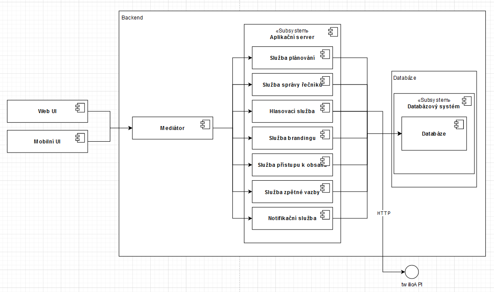
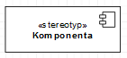
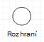
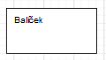

[Domů](/README.md) / [Dokumentace EDA](/Dokumentace/EDA/README.md) / [Component View](/Dokumentace/EDA/pages/component-view.md)

# Component View

## Primary Presentation
Tento komponentový diagram zobrazuje event-driven architekturu systému pro správu konferencí, který podporuje interakce mezi stovkami řečníků, desítkami zaměstnanců a tisíci účastníků. Architektura je navržena pro rychlou a efektivní odezvu na události v reálném čase, což je nezbytné pro dynamické prostředí konferencí.

Vysvětlivka pro diagram:

Komponenta: Jednotka, která zpracovává a reaguje na události (events).

Rozhraní: Definuje typy událostí, které komponenty posílají nebo přijímají.

Balíček: Skupina komponent, které jsou součástí většího procesního toku.

## Element Catalog

- **Webový server (Web Server)**: Slouží jako distribuční uzel pro události mezi klientskou aplikací a ostatními backendovými službami. Zajišťuje zpracování požadavků uživatelů a komunikaci s aplikačním serverem.

- **Aplikační server (Application Server)**: Hlavní zpracovatelská jednotka, která zajišťuje běh aplikační logiky a koordinuje činnost ostatních služeb jako jsou plánování, správa řečníků a hlasování.

- **Služba plánování (Scheduling Service)**: Umožňuje organizátorům plánovat události a řečníkům spravovat jejich přednášky.

- **Služba správy řečníků (Speaker Management Service)**: Poskytuje řečníkům možnost zadávat a upravovat informace o svých přednáškách.

- **Hlasovací služba (Voting Service)**: Umožňuje účastníkům hlasovat o zvýšení nebo snížení počtu přednášek.

- **Služba brandingu (Branding Service)**: Umožňuje přizpůsobit branding pro jednotlivé konference a zajistit tak jejich vizuální jedinečnost.

- **Služba přístupu k obsahu (Content Access Service)**: Řídí přístup k prezentacím a dalšímu obsahu, který je dostupný online pouze pro registrované účastníky.

- **Služba zpětné vazby (Feedback Service)**: Shromažďuje a zpracovává zpětnou vazbu od účastníků prostřednictvím různých kanálů jako jsou webové stránky, e-mail, SMS nebo telefon.

- **Notifikační služba (Notification Service)**: Informuje účastníky o posledních změnách v rozvrhu a dalších důležitých oznámeních.

- **Databázový systém (Database System)**: Skladuje data a zajišťuje jejich konzistenci a dostupnost. Umožňuje obnovu stavu systému pomocí event sourcingu a podporuje operace s daty přes ODBC rozhraní.

Každý z těchto elementů hraje klíčovou roli v architektuře systému a je navržen tak, aby podporoval vysokou dostupnost a škálovatelnost potřebnou pro uspokojení požadavků systému pro správu konferencí.

## Variability Guide
Systém umožňuje adaptabilitu na základě konfigurace zpracování událostí, což je klíčové pro správu různorodých typů událostí a integraci s různými technologickými stacky bez závislosti na konkrétním poskytovateli.

## Other Information
Architektura je motivována potřebou efektivního zpracování velkého objemu událostí, které jsou typické pro konferenční prostředí, a její design podporuje rychlé šíření informací a umožňuje flexibilní škálování podle aktuálních požadavků a provozních podmínek.