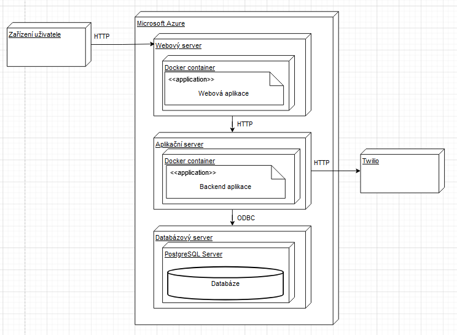
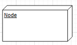
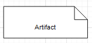
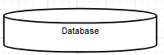

[Domů](/README.md) / [Dokumentace EDA](/Dokumentace/EDA/README.md) / [Deployment View](/Dokumentace/EDA/pages/deployment-view.md)

# Deployment View

## Primary Presentation
Tento diagram nasazení zobrazuje fyzické rozmístění komponent event-driven architektury systému pro správu konferencí v cloudové službě Microsoft Azure. Architektura je rozložena do kontejnerů Docker a integrována s databází PostgreSQL, zajišťující vysokou dostupnost a škálovatelnost pro dynamické prostředí konferencí.

Vysvětlivka pro diagram:

Node (uzel): Jde o fyzické zařízení nebo prostředí pro zpracování softwaru (tzv. execution environment).

Artifact (artefakt): Artefakt označuje fyzický výskyt softwaru.

Database (databáze): Jde o znak databáze, která je součástí SŘBD.

## Element Catalog

- **Webový server (Web Server)**: Hostuje webovou aplikaci a zajišťuje interakci s uživatelskými zařízeními přes HTTP.

- **Webová aplikace (Web Application)**: Umožňuje uživatelům přistupovat k funkcím systému pro správu konferencí přes webové rozhraní.

- **Aplikační server (Application Server)**: Zpracovává logiku backendu a spravuje komunikaci mezi webovou aplikací a databázovým serverem.

- **Backend aplikace (Backend Application)**: Poskytuje aplikační logiku a obchodní pravidla nezbytná pro správu konferencí.

- **Databázový server (Database Server)**: Hostuje databázi PostgreSQL, která skladuje všechna data aplikace.

- **Databáze (Database)**: Shromažďuje a uchovává informace potřebné pro provoz systému.

- **Twilio**: Externí služba integrovaná s aplikačním serverem pro posílání notifikací a zpráv.

Každá komponenta je klíčová pro fungování celého systému a je navržena s ohledem na nejlepší možné využití cloudových služeb.

## Variability Guide
V systému je použito několik mechanismů variability, včetně možnosti nasazení v různých cloudových prostředích a použití kontejnerů Docker, které umožňují rychlou a jednoduchou změnu prostředí bez nutnosti změny kódu aplikace.

## Other Information
Design a rozložení komponent jsou zvoleny s ohledem na jednoduchost, bezpečnost a efektivitu nasazení v cloudovém prostředí. Důraz je kladen na snadnou škálovatelnost a vysokou dostupnost služeb.