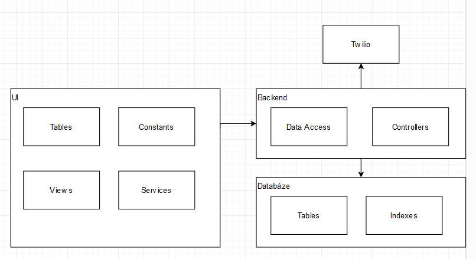
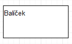
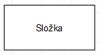

[Domů](/README.md) / [Dokumentace EDA](/Dokumentace/EDA/README.md) / [High Level Module View](/Dokumentace/EDA/pages/module-view.md)

# High Level Module View

## Primary Presentation
Diagram znázorňuje vysokou úroveň modulů a jejich vzájemné vztahy v architektuře aplikace. Ukazuje rozdělení mezi uživatelské rozhraní (UI), backendovou logiku a databázi, stejně jako externí službu Twilio pro posílání zpráv a notifikací.

## Vysvětlivka diagramu

- **Package (balíček)**: Označuje modul (resp. komponentu) vystupující v modelovaném systému.

  

- **Folder (složka)**: Jde o složku v rámci modulu.

  

## Element Catalog

- **UI**
    - **Tables**: Komponenty pro zobrazení tabulek s daty.
    - **Constants**: Definice konstant používaných v UI.
    - **Views**: Definuje různá uživatelská rozhraní a layouty.
    - **Services**: Služby, které UI využívá pro zpracování logiky a interakce s backendem.

- **Backend**
    - **Data Access**: Vrstva zodpovědná za přístup a manipulaci s daty v databázi.
    - **Controllers**: Řídí tok dat mezi UI a backendem a zpracovávají uživatelské akce.

- **Databáze**
    - **Tables**: Struktury tabulek pro ukládání dat.
    - **Indexes**: Indexy pro optimalizaci vyhledávání a dotazů.

- **Twilio**: Externí služba integrace, která poskytuje rozhraní pro odesílání SMS a hlasových zpráv.

## Variability Guide

Systém je navržen s ohledem na flexibilitu, umožňující změny a rozšíření v různých modulech:

- **UI Services**: Může být rozšířeno o nové funkce nebo integraci s dalšími API bez nutnosti zásahu do ostatních částí UI.
- **Backend Controllers**: Můžou být modifikovány nezávisle na změnách v databázové vrstvě, což umožňuje rychlou adaptaci na nové požadavky nebo změny v obchodní logice.
- **Databázové schéma**: Je navrženo tak, aby podporovalo budoucí rozšíření a optimalizace.

## Other Information

Tento diagram je základem pro návrh a implementaci systému, poskytuje přehled o hlavních modulech a jejich účelu. Je nezbytný pro orientaci nových vývojářů v projektu a slouží jako základ pro diskusi o architektuře a návrhových rozhodnutích.