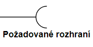

[Domů](/README.md) / [Dokumentace SOA](/Dokumentace/SOA/README.md) / [Component View](/Dokumentace/SOA/pages/module-component.md)

# Component View

## Primary Presentation

Vysvětlivka pro diagram:

Komponenta: Jednotka, která zpracovává a reaguje na události (events).

Rozhraní: Definuje typy událostí, které komponenty posílají nebo přijímají.

Požadované rozhraní: Část reprezentující napojení na rozhraní, které komponenta potřebuje

## Element Catalog

- **Hlasovací služba (Voting Service)**: Poskytuje funkcionalitu pro hlasování uživatelů.
- **Služba pro správu obsahu (Content management service)**: Umožňuje správu obsahu, videí, prezentací, a podobně.
- **Služba plánování (Scheduling service)**: Umožňuje organizátorům plánovat události a řečníkům spravovat jejich přednášky.
- **Služba skinningu (Skinning service)**: Umožňuje přizpůsobovat vzhled stránek podle různých konferencí s odlišným tématem.
- **Notifikační služba (Notification service)**: Zajišťuje odesílání notifikací uživatelům, například o změnách v rozvrhu.
- **Uživatelská služba (Users service)**: Spravuje uživatele systému, jejich role a přihlašování.
- **Notifikační služba (Notification service)**: Zajišťuje odesílání notifikací uživatelům, například o změnách v rozvrhu.
- **Databáze (Database)**: Poskytuje centralizovanou databázi pro trvalé ukládání potřebných dat.
- **Externí komunikační systém (External communication system)**: Zajišťuje SMS a emailovou komunikaci, která nejde přes systém. Zahrnuje například systém Twilio.
- **Enterprise service bus (ESB)**: Middleware pro komunikaci a integraci služeb.
- **Mobile view, web view**: Reprezentuje mobilní a webové klientské rozhraní.
  
## Variability 
None

## Other Information
Díky této architektuře docílíme rozdělení dle funkcionality, což nám pomůže lépe rozdělit práci, rozšiřovat a testovat software. Díky nasazení do cloudu také zajistíme škálovatelnost, jelikož každá ze služeb bude nasazena v separátním containeru. 
