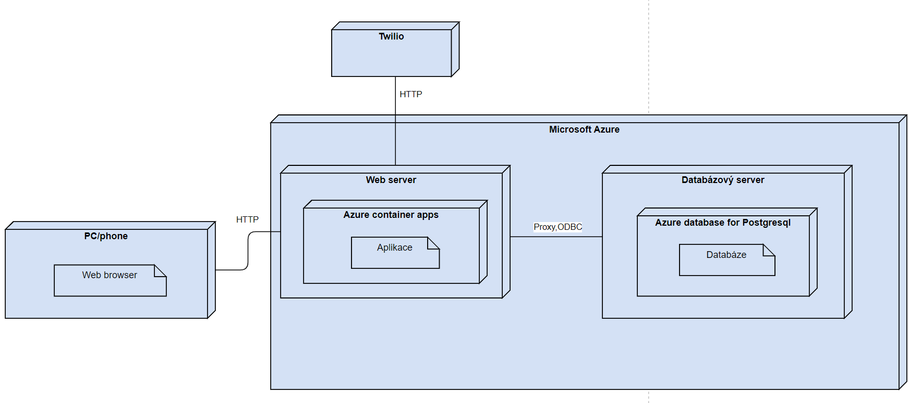
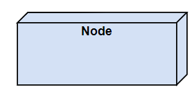
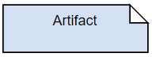

[Domů](/README.md) / [Dokumentace SOA](/Dokumentace/SOA/README.md) / [Deployment View](/Dokumentace/SOA/pages/deployment-view.md)

# Deployment View

## Primary Presentation

Tento diagram nasazení zobrazuje fyzické rozmístění komponent service-oriented architektury systému pro správu konferencí v cloudové službě Microsoft Azure. Architektura je rozložena do Azure container apps a integrována s databází PostgreSQL. Aplikace je dle architektury integrovaná s klientským zařízením a systémem Twilio.

Vysvětlivka pro diagram:

Node (uzel): Jde o fyzické zařízení nebo prostředí pro zpracování softwaru (tzv. execution environment).

Artifact (artefakt): Artefakt označuje fyzický výskyt softwaru.

Protokol: Jde o popis komunikace mezi systémy.

## Element Catalog

- **PC/phone**: Představuje koncové uživatelské zařízení, které může být osobní počítač nebo mobilní telefon. Uživatelé interagují se systémem prostřednictvím tohoto zařízení.

- **Webový prohlížeč (Web browser)**: Představuje webový prohlížeč, skrze který uživatelé aplikaci používají.
  
- **Webový server (Web Server)**: Hostuje webovou aplikaci a zajišťuje interakci s uživatelskými zařízeními přes HTTP.

- **Azure container apps**: Představuje PaaS službu, na které běží aplikace, tedy jednotlivé služby v rámci SOA architektury, frontend

- **Aplikace**: Obsahuje nasazené aplikace v Azure container apps, tedy klientskou aplikaci a aplikace jednotlivých služeb, včetně ESB.

- **Databázový server**: Reprezentuje místo v cloudu, kde jsou databáze

- **Azure database for Postgresql**: Představuje cloudovou službu pro provoz PostgreSQL databáze

- **Databáze**: Shromažďuje a uchovává informace potřebné pro provoz systému.

- **Twilio**: Externí služba integrovaná s webovým serverem pro posílání notifikací a zpráv.

## Variability
V namodelovaném systému lze kompletně změnit cloudového poskytovatele, tedy změnit i Azure container apps, Azure database for Postgresql na služby poskytované jiným poskytovatelem, či provozovat tyto služby on-premise. Místo systému Twilio lze také dosadit jiný systém, včetně protokolu pro komunikaci s daným novým systémem.

## Other Information
Je vhodné zdůraznit, že v části Web server - Azure container apps obsahuje jak klientskou aplikaci, tak ESB, tak všechny služby
