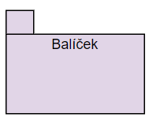

[Domů](/README.md) / [Dokumentace SOA](/Dokumentace/SOA/README.md) / [High Level Module View](/Dokumentace/SOA/pages/module-view.md)

# High Level Module View

## Primary Presentation

Vysvětlivka pro diagram:

Balíček (package): Reprezentuje skupinu prvků, jako jsou třídy, rozhraní, komponenty a další balíčky.

Závislost (dependency): Vztah mezi balíčky, který ukazuje, jak jeden balíček závisí na funkcích nebo vlastnostech jiného balíčku. Šipka směřuje k balíčku, na kterém závisí.

## Element Catalog
- **UI**: Tento balíček představuje uživatelské rozhraní aplikace, přes které uživatelé interagují se systémem.
- **Twilio**: Představuje externí knihovnu pro napojení na systém Twilio, který umožňuje funkce SMS.
- **ESB(Enterprise service bus)**: Jádro systému, které slouží jako komunikační hub pro propojení různých komponent a balíčků. Umožňuje integraci a orchestraci služeb.
- **Voting**: Balíček, který zpracovává logiku a funkcionalitu hlasování.
- **Notifications**: Balíček zodpovědný za odesílání notifikací uživatelům.
- **Skinning**: Balíček zodpovědný za přizpůsobování vzhledu konferencí.
- **ContentManagement**: Balíček pro správu obsahu, který zahrnuje nástroje a služby pro vytváření, úpravy a správu obsahu konference.
- **Scheduling**: Balíček zodpovědný za plánování událostí, přednášek a jejich přiřazení do časových slotů a místností.
- **Users**: Balíček pro správu uživatelů, který zahrnuje funkce autentizaci, autorizaci, správu profilů a další.
- **Database**: Balíček pro ukládání dat do databáze.

## Variability 
...

## Other Information
...
